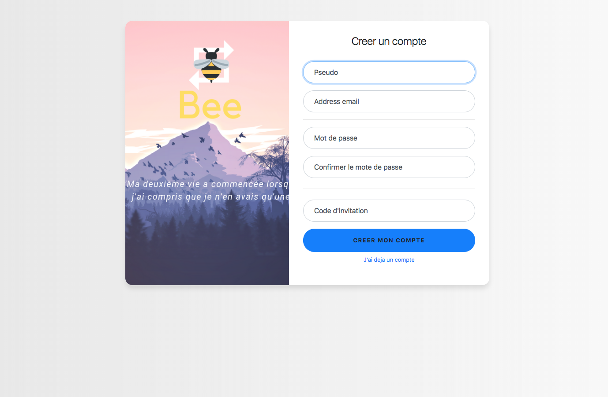

# Khanaton
Khanathon was a 48h cancerology/hematology hackathon that my partner [mphschmitt](https://github.com/mphschmitt) and I took part in. Our objective was to find a solution to help cancer patients bear the waiting time in between test results regarding their illness.  
Most patients that we had the chance to talk to told us that the passivity and inactivity resulting from the treatments were some of the worst moments of their treatment.   
The solution that we came up with was a website where patients, doctors and volunteers can make an account and create/partake in activities, may it be a simple game of tennis, learning how to play the piano or maybe even train for a hike up the Mount Blanc in the Alpes. We also thought that giving the possibility to shadow a volonteer during 2 to 3 days would be a good idea, as we heard that a certan amount of patients lose their job during their treatments.

## Preview
__Home screen:__

__Sign up screen:__

__Website:__

